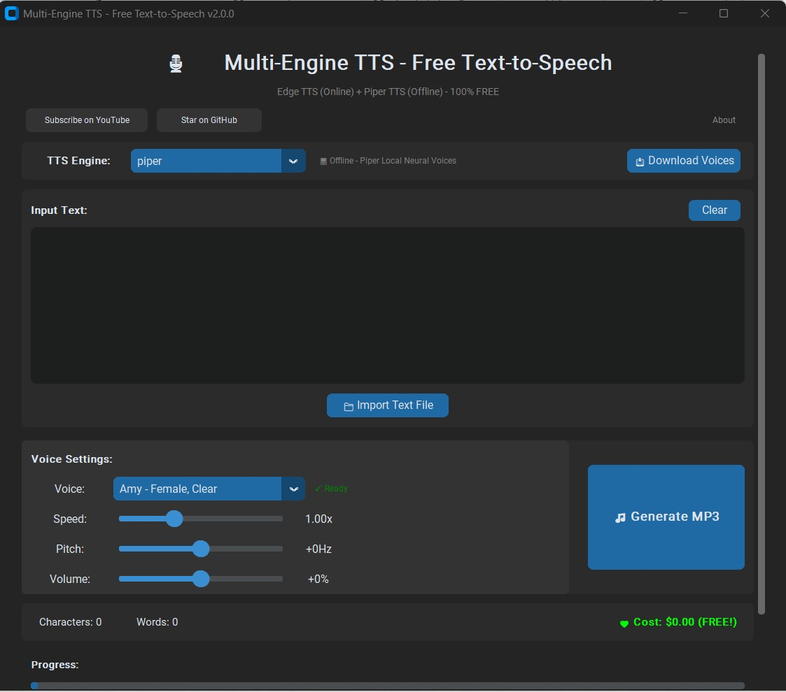

# Multi-Engine TTS - Free Text-to-Speech Application

A powerful desktop application for converting text to speech using multiple TTS engines. **100% FREE - No API keys required!**

[](https://www.youtube.com/@happylearning-gp)
[](https://github.com/ganapap1/TTS_NO_API)
[](https://www.python.org/)
[](LICENSE)

---

## Why Use This Application?

- **Completely FREE** - No API keys, no subscriptions, no hidden costs
- **Two TTS Engines** - Online (Edge TTS) and Offline (Piper TTS)
- **High-Quality Voices** - Microsoft's neural voices + local neural TTS
- **Easy to Use** - Modern GUI with dark/light theme
- **Privacy Friendly** - Piper TTS works 100% offline

---

## Features

### Edge TTS (Online)
- **400+ Neural Voices** - Microsoft's high-quality voices in 90+ languages
- **Multi-Language Support** - Type/filter to find any language quickly
- **Voice Controls** - Adjust speed (0.5x-2x), pitch (-50Hz to +50Hz), and volume (-50% to +50%)
- **MP3 Output** - Standard audio format

### Piper TTS (Offline)
- **No Internet Required** - Completely local processing
- **Auto Language Detection** - Voices auto-filter based on your text
- **Smart Voice Download** - Prompts to download voices when new language detected
- **Voice Download Manager** - Easy voice management with "Check for New Voices"
- **WAV Output** - Lossless audio format
- **Fast Generation** - Optimized for CPU

### Modern UI
- Dark/Light theme toggle
- Real-time progress tracking
- Character and word count
- Settings persistence (remembers your preferences)
- Import text from files
- **"Show All Languages"** - Toggle grouped view for all voices

---

## Screenshots



---

## Quick Start

### Prerequisites
- Python 3.8 or higher
- Windows 10/11
- Internet connection (for Edge TTS and initial setup)

### Installation

1. **Clone the repository**
   ```bash
   git clone https://github.com/ganapap1/TTS_NO_API.git
   cd TTS_NO_API
   ```

2. **Run the installer**
   ```
   Double-click: install.bat
   ```
   This will:
   - Create a virtual environment
   - Install all dependencies
   - Download bundled Piper voices (~200MB)

3. **Run the application**
   ```
   Double-click: run.bat
   ```

### Manual Installation

```bash
# Create virtual environment
python -m venv venv

# Activate it
venv\Scripts\activate

# Install dependencies
pip install -r requirements.txt

# Run the application
python edge_tts_gui.py
```

---

## How to Use

### Step 1: Select TTS Engine
- **Edge** - Online (requires internet) - More voices, voice controls
- **Piper** - Offline (local processing) - No internet needed

### Step 2: Enter Your Text
- Type or import text in any language
- The app auto-detects the language from your text

### Step 3: Choose a Voice
- **Edge TTS**: Type language name to filter (e.g., "French"), select language/voice
- **Piper TTS**: Voices auto-filter by detected language. If no voices available, you'll be prompted to download

### Step 4: Adjust Settings (Edge TTS only)
- **Speed**: 0.5x to 2.0x
- **Pitch**: -50Hz to +50Hz
- **Volume**: -50% to +50%

### Step 5: Generate Audio
1. Click "Generate MP3" (Edge) or "Generate WAV" (Piper)
2. Play the audio or open the folder

> **Tip**: Check "Show all languages" to see all voices grouped by language

---

## Available Voices

### Edge TTS Voices (400+ in 90+ languages)

Popular languages include: English, Spanish, French, German, Italian, Portuguese, Chinese, Japanese, Korean, Arabic, Hindi, and many more.

**Sample English voices:**
| Region | Voices |
|--------|--------|
| **English (US)** | Jenny, Guy, Aria, Davis, Amber, Ana, Andrew, Emma, Brian, Christopher, Eric, Michelle, Roger, Steffan |
| **English (UK)** | Sonia, Ryan, Libby, Maisie, Thomas |
| **English (Australia)** | Natasha, William |
| **English (India)** | Neerja, Prabhat |

> **Tip**: Type any language name in the language filter to quickly find voices!

### Piper TTS Voices (55+ languages supported)

**Bundled (installed automatically):**
- **Amy** (US Female) - Clear, professional
- **Ryan** (US Male) - Broadcast quality
- **Lessac** (US Female) - Expressive
- **Cori** (UK Female) - British accent

**Additional voices**: Use "Download Voices" to add more languages. The app auto-prompts when you type in a new language!

---

## Project Structure

```
TTS_NO_API/
├── edge_tts_gui.py      # Main application
├── tts_engines/         # TTS engine modules
│   ├── __init__.py
│   ├── base_engine.py   # Abstract base class
│   ├── edge_engine.py   # Edge TTS implementation
│   └── piper_engine.py  # Piper TTS implementation
├── models/piper/        # Downloaded Piper voice models
├── requirements.txt     # Python dependencies
├── install.bat          # Windows installer
├── run.bat              # Application launcher
├── LICENSE              # MIT License
└── README.md
```

---

## Requirements

| Package | Version | Description |
|---------|---------|-------------|
| `edge-tts` | >=7.0.0 | Microsoft Edge TTS |
| `customtkinter` | >=5.2.0 | Modern GUI framework |
| `piper-tts` | >=1.2.0 | Local neural TTS |
| `langdetect` | >=1.0.9 | Auto language detection |

---

## Troubleshooting

### Common Issues

#### "edge-tts not installed" error
```bash
venv\Scripts\pip.exe install edge-tts
```

#### "piper-tts not installed" error or "Piper (Offline) is not available"

**Solution 1: Manual Installation**
```bash
venv\Scripts\pip.exe install piper-tts
```

**Solution 2: Verify Installation**
```bash
venv\Scripts\python.exe -c "import piper"
```
If this fails, try:
```bash
venv\Scripts\pip.exe install piper-tts --no-cache-dir --force-reinstall
```

**Solution 3: Check Python Version**
```bash
python --version
```
Piper-tts requires Python 3.8 or higher.

**Solution 4: Always Use run.bat**
Don't run `python edge_tts_gui.py` directly. Always use:
```
run.bat
```
This ensures you're using the correct virtual environment.

#### Application won't start
1. Make sure Python 3.8+ is installed
2. Run `install.bat` again
3. Check error messages in the terminal

#### No audio generated
- **Edge TTS**: Verify internet connection
- **Piper TTS**: Make sure the voice is downloaded (check for "Ready" status)
- Try a different voice
- Check the output folder path is valid

#### Sliders not working
- Speed, pitch, and volume controls only work with **Edge TTS**
- Piper TTS uses fixed voice characteristics

---

## Frequently Asked Questions

### Q: Is this really free?
**A:** Yes! Both Edge TTS and Piper TTS are completely free. No API keys or subscriptions required.

### Q: Can I use this offline?
**A:** Yes! Switch to Piper TTS engine for 100% offline text-to-speech.

### Q: What's the difference between Edge and Piper?
**A:**
- **Edge TTS**: More voices, voice controls (speed/pitch/volume), requires internet
- **Piper TTS**: Works offline, faster generation, but fewer customization options

### Q: Can I use this for commercial projects?
**A:** Edge TTS is not an official Microsoft API and may have usage restrictions. For commercial use, consider official APIs like Google Cloud TTS or Amazon Polly. Piper TTS is MIT licensed and can be used commercially.

### Q: How do I add more Piper voices?
**A:** Click "Download Voices" button when Piper engine is selected, then click Download next to any voice you want.

---

## Disclaimer

This application uses:
- **Microsoft Edge TTS** - A free service provided by Microsoft. This is not an official API and may change without notice.
- **Piper TTS** - Open source local TTS (MIT License)

For production or commercial use, consider official APIs like Google Cloud TTS or Amazon Polly.

---

## Contributing

Contributions are welcome! Please feel free to submit a Pull Request.

### How to Contribute
1. Fork the repository
2. Create your feature branch (`git checkout -b feature/AmazingFeature`)
3. Commit your changes (`git commit -m 'Add some AmazingFeature'`)
4. Push to the branch (`git push origin feature/AmazingFeature`)
5. Open a Pull Request

---

## License

This project is licensed under the MIT License - see the [LICENSE](LICENSE) file for details.

---

## Author

**Happy Learning-GP**

- YouTube: [@happylearning-gp](https://www.youtube.com/@happylearning-gp)
- GitHub: [ganapap1](https://github.com/ganapap1)

---

## Support This Project

If you find this project useful:

1. **Subscribe** to my [YouTube channel](https://www.youtube.com/@happylearning-gp) for tutorials
2. **Star** this repository on [GitHub](https://github.com/ganapap1/TTS_NO_API)
3. **Share** with others who might benefit
4. **Report issues** or suggest features

---

## Changelog

### Version 2.1.0
- **Multi-Language Support** - Auto language detection from text (55+ languages)
- **Smart Voice Filtering** - Voices auto-filter by detected language
- **Language Download Prompt** - Auto-prompts to download voices for new languages
- **Check for New Voices** - Button to find new voices for installed languages
- **Show All Languages** - Toggle to view all voices grouped by language
- **Enhanced Edge TTS** - 400+ voices in 90+ languages with easy filtering

### Version 2.0.0
- Added Piper TTS engine for offline text-to-speech
- Added voice download manager
- Added engine selector dropdown
- Improved UI with channel branding
- Added settings persistence
- Sliders now disable for Piper (not supported)

### Version 1.0.0
- Initial release with Edge TTS
- Basic text-to-speech functionality
- Voice selection and controls

---

**Happy Learning!**
